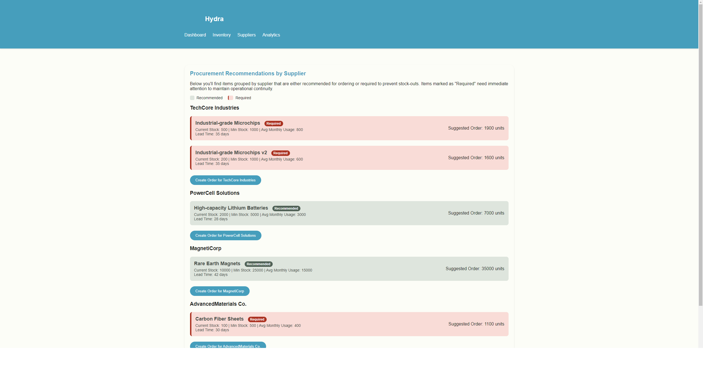

# Hydra

Hydra -- это прилложение, которое помогает бизнесу совершать своевременные закупки товара к себе на склады, для избегания
ситуаций, когда востребованный товар отсутствует.

## Визуальная схема фронтенда

## Документация

1. Маркетинг и аналитика
    1. [Целевая аудитория](./docs/01-biz/01-target-audience.md)
    2. [Заинтересанты](./docs/01-biz/02-stakeholders.md)
    3. [Пользовательские истории](./docs/01-biz/03-bizreq.md)
2. Аналитика:
    1. [Функциональные требования](./docs/02-analysis/01-functional-requiremens.md)
    2. [Нефункциональные требования](./docs/02-analysis/02-nonfunctional-requirements.md)
3. Архитектура:
   1. [C4 схема](./docs/03-arch/arch.md)
4. DevOps
   1. [Файлы сборки](./deploy)
   2. [Схема сборки](./docs/04-devops/devops.md)